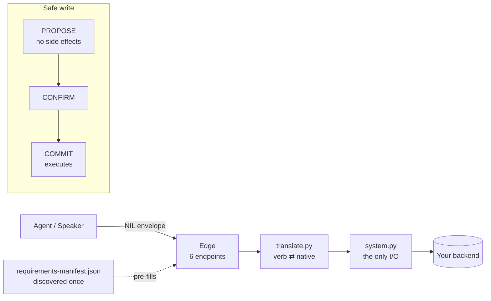

<div align="center">

# nilscript

**The neutral standard for letting agents act in real systems — safely, with confirmation, and without bespoke glue per backend.**

*OpenAPI for agent-actions.*

[](https://github.com/nilscript-org/nilscript/actions/workflows/ci.yml)
[](https://github.com/nilscript-org/nilscript/actions/workflows/ci.yml)
[](https://www.python.org/)
[](src/nilscript/nil/versions/0.2.0.md)
[](LICENSE)
[](docs/contributing-an-adapter.md)

[Quickstart](#quickstart) · [Commands](#command-tour) · [How it works](#how-it-works) · [Build an adapter](docs/contributing-an-adapter.md) · [Spec](src/nilscript/nil/versions/0.2.0.md) · [Status](#where-it-stands)

</div>

---

## Why

- **Every agent↔system integration is rebuilt from scratch.** NIL is the neutral wire contract, so you build an adapter *once*.
- **Backends hide their real requirements.** `nilscript scan` discovers them into a shareable `requirements-manifest.json` — you stop learning by collision.
- **Agents must not write blindly.** `PROPOSE` has no side effects; nothing commits without confirmation; `ROLLBACK` *previews* a compensation, never a silent write.
- **Reversibility is earned, not asserted.** Every verb declares a tier (`REVERSIBLE` / `COMPENSABLE` / `IRREVERSIBLE`) the conformance harness actually checks.
- **The standard is data, not software.** Plain JSON + docs any language can implement; the Python SDK/CLI is an optional convenience.

## Quickstart

```bash
# PyPI release is pending — install from source today:
pip install "nilscript[cli] @ git+https://github.com/nilscript-org/nilscript.git"

nilscript verbs                                  # the verb catalog from the standard
nilscript scaffold-shim --name my-nil-adapter    # a bootable shim skeleton for any backend
cd my-nil-adapter && pip install -e ".[dev]" && pytest   # red until you fill 3 files (by design)
```

> Three files become yours — `system.py` (the one place I/O happens), `translate.py` (verb ⇄ native),
> `compensation.py` (reversibility). Everything else is generated and identical across adapters.
> Full walkthrough: **[docs/contributing-an-adapter.md](docs/contributing-an-adapter.md)**.

## Command tour

`nilscript` is the toolkit for building and verifying adapters from the standard.

| Command | What it does |
| --- | --- |
| `nilscript verbs` | List the verb catalog from the standard. |
| `nilscript profile <verb>` | Print a verb's arg-schema profile. |
| `nilscript export-openapi` | Emit an OpenAPI 3.1 document for the six NIL endpoints. |
| `nilscript scaffold-shim --name <n>` | Generate a bootable NIL shim skeleton for a backend. |
| `nilscript scan` | Discover a system's hidden requirements → `requirements-manifest.json`. |
| `nilscript conformance-test --url <shim> --verb <v>` | Run the conformance matrix against a live shim. |
| `nilscript manifest <validate\|show\|diff\|…>` | Work with requirements manifests. |

## How it works

NIL separates the **neutral intent layer** from **backend reality**. An agent speaks NIL to a thin
edge; the edge translates to native calls; safe writes are two-step.



The two layers:

| Layer | Name | What it is |
| --- | --- | --- |
| **Operations** | **NIL** — Network Intent Layer | The wire contract: propose/answer/rollback, the envelope, grants, refusals, per-domain profiles. Seven performatives (**SEQRD-PC**: STATUS·EVENT·QUERY·ROLLBACK·DECIDE·PROPOSE·COMMIT) on the stable `nil: "0.1"` wire. |
| **Orchestration** | **nilscript DSL** | A declarative, JSON-based, LLM-native language *above* NIL: an agent writes a program, a static validator admits it, a durable runtime executes it. |

## The ecosystem

| Repo | Role |
| --- | --- |
| **nilscript** (this) | The protected core — CLI, generator, conformance engine, schemas. Never forked to build an adapter. |
| [**nil-adapter-template**](https://github.com/nilscript-org/nil-adapter-template) | The fork base authors use ("Use this template"). Red until filled. |
| [**pocketbase-nil-adapter**](https://github.com/nilscript-org/pocketbase-nil-adapter) | First 🟢 Official Verified Adapter — a real, conformant PocketBase shim (16/16). |

Architecture & contribution: [adapter-ecosystem-strategy.md](docs/adapter-ecosystem-strategy.md) ·
[contributing-an-adapter.md](docs/contributing-an-adapter.md).

## Install

```bash
pip install nilscript          # the standard only (JSON + docs) — zero runtime deps   [PyPI pending]
pip install nilscript[cli]     # + the adapter toolkit (scaffold-shim, scan, manifest)
pip install nilscript[sdk]     # + the Python SDK (httpx, pydantic)
```

```python
import nilscript
nilscript.spec_path()                               # path to bundled NIL schemas
nilscript.load_profile("commerce.process_refund")   # a profile's JSON Schema
from nilscript.sdk import NilClient                  # only with [sdk]
```

The standard is language-neutral JSON: a Go/TypeScript/Rust implementer reads the schemas in
`src/nilscript/nil/` and `src/nilscript/dsl/` directly — no per-language package reserved (the
OpenAPI / JSON-Schema model).

## Where it stands

- ✅ **Spec v0.2** released (`nil/versions/0.1.0.md`, `0.2.0.md`); SEQRD-PC / ROLLBACK in the toolkit.
- ✅ **Conformance harness shipped** — offline proof + live `conformance-test` + `manifest validate`.
- ✅ **160 tests** green; one **live proof** (a real customer + invoice into a live ERPNext, from the standard alone).
- ✅ **First Official Verified Adapter** (PocketBase) standalone and green.
- 🚧 **No merchant adoption at scale yet** — this is a *young open standard (v0.2)*, not battle-tested in production. We lead with the real proof, not traction claims.
- 🚧 **PyPI / docs site / landing** are staged, not yet live.

## Contributing & community

- Change the **standard**: [CONTRIBUTING.md](CONTRIBUTING.md) · [GOVERNANCE.md](GOVERNANCE.md) (spec is extracted from running code).
- Build an **adapter**: [docs/contributing-an-adapter.md](docs/contributing-an-adapter.md) → open an *Adapter submission* issue.
- Security: [SECURITY.md](SECURITY.md) (90-day coordinated disclosure). Conduct: [CODE_OF_CONDUCT.md](CODE_OF_CONDUCT.md).

## License

Dual-licensed by artifact class: **CC BY 4.0** for specification text, **Apache 2.0** for schemas,
conformance vectors, and SDK code. See [LICENSE](LICENSE).

<div align="center">

**[nilscript.org](https://nilscript.org)** · a neutral standard, openly governed

</div>
