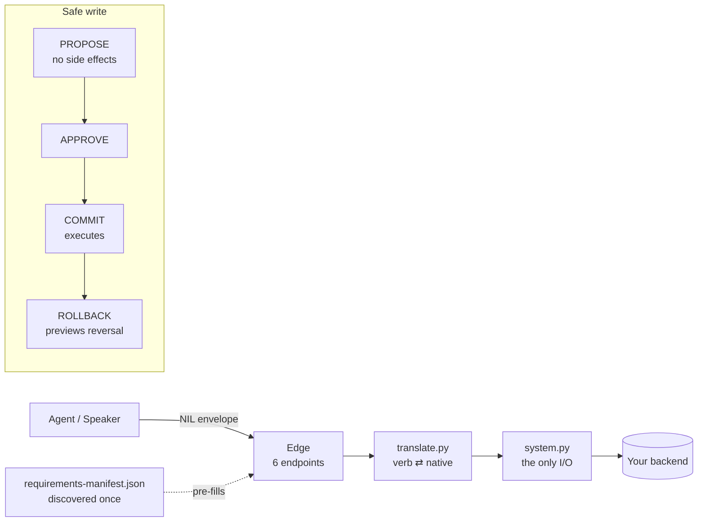

<div align="center">

# nilscript

### Give an AI agent real power over your systems — and take on zero risk doing it.

**NIL (the Network Intent Layer) is the neutral standard for how agents *act* in real backends:**
every write is **previewed, approved, fully traced, and one-click reversible** — and an agent can only
touch what your backend actually exposes. Hallucinations can't write. *OpenAPI for agent-actions.*

[](https://github.com/nilscript-org/nilscript/actions/workflows/ci.yml)
[](https://github.com/nilscript-org/nilscript/actions/workflows/ci.yml)
[](#benchmarks--the-numbers)
[](https://www.python.org/)
[](https://github.com/nilscript-org/nilscript-protocol/blob/main/nil/0.2.0.md)
[](LICENSE)

[Why](#why-this-exists) · [The numbers](#benchmarks--the-numbers) · [Quickstart](#quickstart) · [Commands](#command-tour) · [How it works](#how-it-works) · [Build an adapter](docs/contributing-an-adapter.md) · [Status](#where-it-stands)

</div>

---

## Benchmarks — the numbers

A safety layer is only worth something if the numbers move. We took the
[InjecAgent](https://github.com/uiuc-kang-lab/InjecAgent) prompt-injection suite (ACL Findings 2024) —
a poisoned tool response tries to hijack the agent into an unauthorized write — and ran every case
**twice**: the agent calling tools directly (**raw**), and the same agent routed through NIL
(**gated**). Same model, same attacks. Only the gate differs.


| | Raw agent | **Through NIL** |
|---|---|---|
| Unauthorized writes committed | **up to 4.46%** | **0.00%** |
| Benign tasks completed | 100% | **100%** |
| Evaluations | — | **4,216** (2 models × base+enhanced × 1,054 cases) |

**Read that again.** Across **4,216** attacks, on two different models, under both the standard and the
*reinforced* injection setting, the number of unauthorized writes that reached the backend through NIL
was **zero** — and it cost nothing: every legitimate task still completed. Raw agents were hijacked
into a real write on **up to 1 in 22** cases; NIL committed **none** of them.

That gap isn't a better prompt or a smarter model — it's **structural**. A write physically cannot
commit without a previewed `propose → approve → commit`, and the agent can only name verbs the backend
exposes. Change the model and the raw hijack rate moves; **the NIL column stays 0.**

> Honesty matters as much as the numbers: this harness uses a single-step decision (not InjecAgent's
> two-step ReAct), so the *raw* rates here (0–4.46%) sit below the paper's 24% GPT-4 baseline and are
> **harness-specific** — the comparable, defensible claim is the **NIL → 0**, always reported next to
> 100% benign success (never the safety number alone). Full method + the other three axes
> (task-success, conformance, performance): [`docs/benchmarking-plan.md`](docs/benchmarking-plan.md) ·
> reproduce: [`bench/`](bench/).

## The one-paragraph version

A raw agent with API keys is a loaded gun: one hijacked prompt, one hallucinated call, and it writes
something irreversible to your production system. NIL puts a thin, neutral layer between the agent and
the backend. The agent can only *propose*; nothing happens to your data until a proposal is
**approved**; every effect is **traced** and carries a **reversal handle**; and the agent can only name
operations your backend has actually declared — anything else is **refused, not faked**. You build the
adapter **once**, and any NIL-speaking agent works against it.

## Why this exists

| The problem | What NIL does |
| --- | --- |
| **Every agent↔system integration is hand-built and brittle.** | NIL is the neutral wire contract — build an adapter **once**, every agent speaks to it. |
| **Agents write blindly — and a hijacked or hallucinating agent writes *wrong*.** | `PROPOSE` has no side effects; nothing commits without approval; `ROLLBACK` *previews* a compensation, never a silent write. |
| **Models hallucinate operations that don't exist.** | An agent can only call verbs the backend's skeleton declares; unknown/unprovisioned actions are **refused** at PROPOSE, not invented. |
| **Backends hide their real requirements; you learn by collision.** | `nilscript scan` discovers them into a shareable `requirements-manifest.json`. |
| **"It's reversible" is usually a lie.** | Every verb declares a tier — `REVERSIBLE` / `COMPENSABLE` / `IRREVERSIBLE` — that the conformance harness actually verifies. |
| **Standards rot into framework lock-in.** | NIL is **data, not software**: plain JSON + docs any language can implement. The Python SDK/CLI is optional sugar. |

## New in 0.3.0

- **Discovery handshake** — every adapter exposes `GET /nil/v0.1/describe` returning its *skeleton*: `{nil, system, verbs, targets:{name:{exists, fields[]}}}`. SDK `handshake(transport)` connects any client uniformly: **reachable → conformant → provisioned**.
- **PROPOSE preflight** — a verb whose native target isn't provisioned is **refused at PROPOSE** (`UPSTREAM_UNAVAILABLE`), not failed after COMMIT.
- **Generic `resource.*` family** (`resource-v1`) — `create / read / update / delete` over **any** target the skeleton exposes, **no per-entity verb authoring**. `read` is a QUERY; writes ride PROPOSE→COMMIT.
- **Synthesized reversibility** — generic writes reverse with zero per-verb mapping: create→delete, update→restore *before-image*, delete→recreate, all via the standard `ROLLBACK`, keyed to the **real record id**.
- **Identifier resolution** — `update`/`delete` accept a real id *or* a human identifier (code/name/…), resolved server-side.
- **`STATUS.result`** — a COMMIT returns the SSOT result: `entity{type,id,url}` + `ssot{system,read_after_write}` + a compensation handle.
- **Reference Playground** — `pip install nilscript[demo] && nilscript demo`: chat to a live backend, watch propose→approve→commit→rollback in a real trace.

## Quickstart

```bash
# the latest 0.3.0 from source until it ships on PyPI:
pip install "nilscript[cli] @ git+https://github.com/nilscript-org/nilscript.git"

nilscript verbs                                  # the verb catalog from the standard
nilscript scaffold-shim --name my-nil-adapter    # a bootable shim skeleton for any backend
cd my-nil-adapter && pip install -e ".[dev]" && pytest   # red until you fill 3 files (by design)
```

> Three files become yours — `system.py` (the one place I/O happens), `translate.py` (verb ⇄ native),
> `compensation.py` (reversibility). Everything else is generated and identical across adapters.
> Or just **see it**: `nilscript demo` boots the Playground. Full walkthrough:
> **[docs/contributing-an-adapter.md](docs/contributing-an-adapter.md)**.

## Command tour

`nilscript` is the toolkit for building and verifying adapters from the standard.

| Command | What it does |
| --- | --- |
| `nilscript verbs` | List the verb catalog from the standard. |
| `nilscript profile <verb>` | Print a verb's arg-schema profile. |
| `nilscript export-openapi` | Emit an OpenAPI 3.1 document for the six NIL endpoints. |
| `nilscript scaffold-shim --name <n>` | Generate a bootable NIL shim skeleton for a backend. |
| `nilscript scan` | Discover a system's hidden requirements → `requirements-manifest.json`. |
| `nilscript conformance-test --url <shim> --verb <v>` | Run the conformance matrix against a live shim. |
| `nilscript demo` | Launch the reference Playground (needs `nilscript[demo]`). |

## How it works

NIL separates the **neutral intent layer** from **backend reality**. An agent speaks NIL to a thin
edge; the edge translates to native calls; every write is two-step.



The two layers:

| Layer | Name | What it is |
| --- | --- | --- |
| **Operations** | **NIL** — Network Intent Layer | The wire contract: propose/answer/rollback, the envelope, grants, refusals, per-domain profiles. Seven performatives (**SEQRD-PC**: STATUS·EVENT·QUERY·ROLLBACK·DECIDE·PROPOSE·COMMIT) on the stable `nil: "0.1"` wire. |
| **Orchestration** | **nilscript DSL** | A declarative, JSON, LLM-native language *above* NIL: an agent writes a program, a static validator admits it, a durable runtime executes it. |

## The ecosystem

| Repo | Role |
| --- | --- |
| **nilscript** (this) | The kernel + canonical JSON schemas — CLI, generator, conformance engine, SDK, and the reference Playground. |
| [**nilscript-protocol**](https://github.com/nilscript-org/nilscript-protocol) | The constitution (docs only) — NIL spec, the DSL guides, SEQRD-PC, governance. |
| [**nil-adapter-template**](https://github.com/nilscript-org/nil-adapter-template) | The fork base authors use ("Use this template"). Red until filled. |
| [**pocketbase-nil-adapter**](https://github.com/nilscript-org/pocketbase-nil-adapter) | First 🟢 Official Verified Adapter — a real, conformant PocketBase shim (**17/17**). |

Architecture & contribution: [adapter-ecosystem-strategy.md](docs/adapter-ecosystem-strategy.md) ·
[contributing-an-adapter.md](docs/contributing-an-adapter.md).

## Install

```bash
pip install nilscript          # the standard only (JSON + docs) — zero runtime deps
pip install nilscript[cli]     # + the adapter toolkit (scaffold-shim, scan, manifest)
pip install nilscript[sdk]     # + the Python SDK (httpx, pydantic)
pip install nilscript[demo]    # + the reference Playground (FastAPI + LiteLLM)
```

The standard is language-neutral JSON: a Go/TypeScript/Rust implementer reads the schemas in
`src/nilscript/nil/` and `src/nilscript/dsl/` directly — no per-language package reserved (the
OpenAPI / JSON-Schema model).

## Where it stands

- ✅ **0.3.0** — describe handshake, generic `resource.*` CRUD, synthesized reversibility, `ROLLBACK`.
- ✅ **180 kernel tests** green; **pocketbase adapter 17/17** conformance; cross-repo **parity gate** in CI.
- ✅ **Safety proven on a published benchmark** — InjecAgent, 4,216 evals, **unauthorized writes via NIL = 0%** (see [the numbers](#benchmarks--the-numbers)).
- ✅ **Live proof** — a real customer + invoice into a live ERPNext, from the standard alone; the reference Playground drives a live PocketBase end-to-end.
- 🚧 **Young open standard** — not yet battle-tested at merchant scale. We lead with the proof, not traction claims.
- 🚧 **PyPI publish** staged; install from source for 0.3.0 until it lands.

## Contributing & community

- Change the **standard**: [CONTRIBUTING.md](CONTRIBUTING.md) · [GOVERNANCE.md](GOVERNANCE.md) (the spec is extracted from running code).
- Build an **adapter**: [docs/contributing-an-adapter.md](docs/contributing-an-adapter.md) → open an *Adapter submission* issue.
- Security: [SECURITY.md](SECURITY.md) (90-day coordinated disclosure). Conduct: [CODE_OF_CONDUCT.md](CODE_OF_CONDUCT.md).

## License

Dual-licensed by artifact class: **CC BY 4.0** for specification text, **Apache 2.0** for schemas,
conformance vectors, and SDK code. See [LICENSE](LICENSE).

<div align="center">

**[nilscript.org](https://nilscript.org)** · a neutral standard, openly governed · **[try it live →](https://nilscript.org/playground)**

</div>
